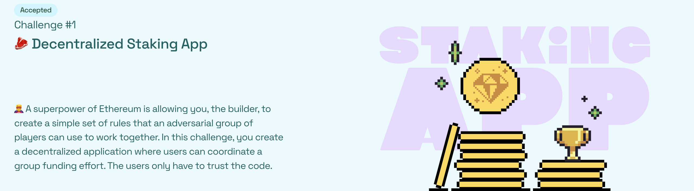
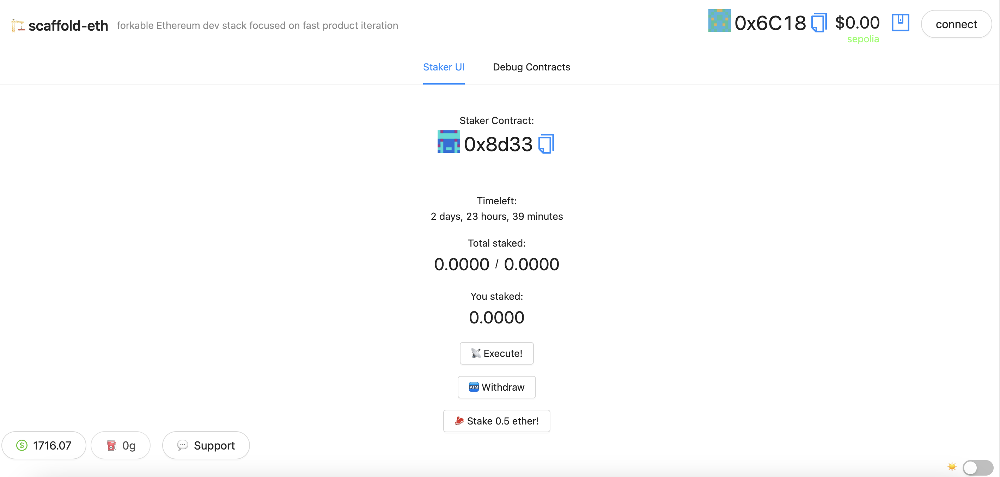

# 🏗 scaffold-eth | 🏰 BuidlGuidl

> 🦸 A superpower of Ethereum is allowing you, the builder, to create a simple set of rules that an adversarial group of players can use to work together. In this challenge, you create a decentralized application where users can coordinate a group funding effort. If the users cooperate, the money is collected in a second smart contract. If they defect, the worst that can happen is everyone gets their money back. The users only have to trust the code.

> 🏦 Build a `Staker.sol` contract that collects **ETH** from numerous addresses using a payable `stake()` function and keeps track of `balances`. After some `deadline` if it has at least some `threshold` of ETH, it sends it to an `ExampleExternalContract` and triggers the `complete()` action sending the full balance. If not enough **ETH** is collected, allow users to `withdraw()`.

> 🎛 Building the frontend to display the information and UI is just as important as writing the contract. The goal is to deploy the contract and the app to allow anyone to stake using your app. Use a `Stake(address,uint256)` event to <List/> all stakes.

> 🌟 The final deliverable is deploying a Dapp that lets users send ether to a contract and stake if the conditions are met

Staker Contract
CODE: https://sepolia.etherscan.io/address/0x8d3369413A67E22946b962D6375904804B146dCD#code

ExampleExternalContract Contract
CODE: https://sepolia.etherscan.io/address/0x02E66eEfeeA950Cdf3644F3C7EF918C51bEE6232#code

DEMO: http://sharp-face.surge.sh/

🚩 project deploy on Ethereum Sepolia Testnet 🚩

